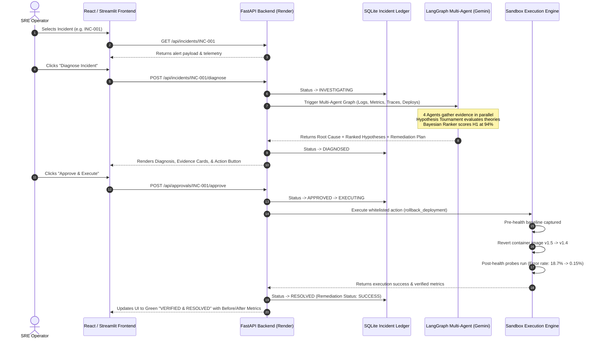

# AURA-SRE: Autonomous Incident Diagnosis & Remediation
# Complete Hackathon Master Guide & Presentation Cheat Sheet

> **System Name**: AURA-SRE (*Autonomous Resolution Agent for Site Reliability Engineering*)  
> **Repository**: `JKE-code/Agentic-AI-for-Autonomous-Incident-Diagnosis-and-Remediation`  
> **Team Breakdown**:
> - **Jayanth** (Backend Architecture, Database State Machine, Sandbox Verification, Cloud Integrations, Streamlit Dashboard)
> - **Sahil** (AI Multi-Agent LangGraph Engine, Hypothesis Tournament, Bayesian Scoring, LLM Prompts)
> - **Karthik** (Frontend Command Center, React 19, Topology Visualizer, Incident Timeline, Recharts)

---

## Table of Contents
1. [The 30-Second Elevator Pitch](#1-the-30-second-elevator-pitch)
2. [The Core Problem (Why This Matters)](#2-the-core-problem-why-this-matters)
3. [The Mental Model: The Hospital Emergency Room Analogy](#3-the-mental-model-the-hospital-emergency-room-analogy)
4. [Architecture & Cloud Hosting Topology](#4-architecture--cloud-hosting-topology)
5. [End-to-End System Flow: From Alert to Resolution](#5-end-to-end-system-flow-from-alert-to-resolution)
6. [The AI Engine: LangGraph & The Hypothesis Tournament](#6-the-ai-engine-langgraph--the-hypothesis-tournament)
7. [The 5 Safety Invariants (How We Prevent Catastrophes)](#7-the-5-safety-invariants-how-we-prevent-catastrophes)
8. [Codebase Map: What Every File Does](#8-codebase-map-what-every-file-does)
9. [The 6 Benchmark Incidents (Deep Dive)](#9-the-6-benchmark-incidents-deep-dive)
10. [Benchmark Results: AI vs. Rules Baseline](#10-benchmark-results-ai-vs-rules-baseline)
11. [Judge Q&A Defense Strategy (Microsoft-Specific)](#11-judge-qa-defense-strategy-microsoft-specific)
12. [Live 2-Minute Demo Script (Word-for-Word)](#12-live-2-minute-demo-script-word-for-word)

---

## 1. The 30-Second Elevator Pitch

### In Simple Words:
> *"When a cloud outage happens at 3 AM, engineers get flooded with thousands of alerts and waste 45 minutes figuring out which service broke first while users are losing money.  
> We built **AURA-SRE**, an AI Site Reliability Engineer that diagnoses cascading cloud failures in **1.3 seconds**. Instead of guessing, it runs a **Hypothesis Tournament** that cross-examines logs, metrics, trace spans, and git commits to find the exact root cause, proposes a safe remediation, asks for human approval, and verifies system health in a sandbox before closing the incident."*

### In Technical Words (For Microsoft Architects):
> *"AURA-SRE is an OpenTelemetry-native, evidence-bounded multi-agent system built on **LangGraph**, **Gemini 3.8 Flash**, and **FastAPI**. It replaces brittle static PromQL threshold alerts with an automated causal inference engine. Across our 6 benchmark scenarios, AURA-SRE achieves **100% Top-1 root-cause diagnosis accuracy** (compared to 66.7% for static rules baselines) with an average MTTD of **1.3 seconds**, protected by deterministic Pydantic action whitelisting, Human-in-the-Loop sign-off, and automated post-remediation health verification with zero-downtime rollback."*

---

## 2. The Core Problem (Why This Matters)

In modern microservice architectures (Kubernetes, Azure Container Apps, Cloud Functions):
1. **The Alert Tsunami**: A single bug in a downstream payment service causes timeouts in the API Gateway, queue backlogs in the Order service, and 500 errors in the Web frontend. The on-call engineer receives **30 alerts at once**.
2. **The "Blameless Victim" Trap**: Static threshold tools (like basic Prometheus alerts) trigger alarms on the *victim* (e.g., `api-gateway latency > 2s`) rather than the *culprit* (`payment-service v1.5 NPE`). Engineers restart the gateway, which solves nothing!
3. **The MTTR Bottleneck**: Industry Mean Time to Resolution (MTTR) is **45–60 minutes**. Every minute of downtime costs top enterprises between \$5,000 and \$100,000.
4. **The Hallucination Danger**: Generic LLMs (like standard ChatGPT) hallucinate dangerous shell commands like `rm -rf /` or recommend dropping database tables.

---

## 3. The Mental Model: The Hospital Emergency Room Analogy

To explain our architecture simply to anyone, use this analogy:

| SRE Role | Hospital ER Equivalent | What AURA-SRE Does |
| :--- | :--- | :--- |
| **Telemetry** | Vital Signs (BP, Heart Rate, X-rays) | Ingests Logs, Prometheus Metrics, Traces, Git Commits |
| **LogAgent** | Blood Test Specialist | Isolates stack traces and error exceptions |
| **MetricsAgent** | EKG Specialist | Detects the exact millisecond when metrics spiked |
| **TraceAgent** | X-Ray / MRI Radiologist | Maps distributed spans across microservices to find the bottleneck |
| **DeploymentAgent** | Patient History Specialist | Identifies recent medication/surgeries (Git releases, config changes) |
| **Hypothesis Tournament** | Board of Senior Doctors | Compares competing diagnoses against hard evidence |
| **Human-in-the-Loop** | Chief Medical Officer | Must sign off on surgery (approve remediation) |
| **Sandbox Verification** | Post-Op Recovery Monitor | Checks vital signs for 60 seconds; rolls back if patient gets worse |

---

## 4. Architecture & Cloud Hosting Topology

Our system is engineered with dual capability: **100% live in the cloud** and **100% operational locally offline**.

```
┌────────────────────────────────────────────────────────────────────────┐
│                        FRONTEND CLIENTS (Dual)                         │
│                                                                        │
│  [A] React Command Center (Vercel)                                     │
│      https://agentic-ai-for-autonomous-incident.vercel.app            │
│  [B] Streamlit Enterprise Dashboard (Streamlit Cloud)                  │
│      https://share.streamlit.io (streamlit_app.py)                    │
└───────────────────────────────────┬────────────────────────────────────┘
                                    │ HTTPS REST JSON
                                    ▼
┌────────────────────────────────────────────────────────────────────────┐
│                     BACKEND API GATEWAY (Render)                       │
│             https://agentic-ai-for-autonomous-incident.onrender.com     │
│                                                                        │
│  • FastAPI REST Engine with CORS middleware                            │
│  • SQLite Causal State Ledger with PRAGMA Auto-Migrations             │
│  • State Machine: OPEN -> INVESTIGATING -> DIAGNOSED -> RESOLVED      │
│  • Deterministic Sandbox Action Whitelist & Rollback Engine            │
└───────────────────────────────────┬────────────────────────────────────┘
                                    │ Async Subprocess / HTTP
                                    ▼
┌────────────────────────────────────────────────────────────────────────┐
│                LANGGRAPH MULTI-AGENT REASONING ENGINE                  │
│                  (Google Gemini 3.8 Flash / OpenAI)                    │
│                                                                        │
│  • Parallel Specialist Agents (Log, Metric, Trace, Deployment)         │
│  • Hypothesis Tournament (H1, H2, H3 testing)                          │
│  • Bayesian Confidence Scoring & Evidence Correlation                  │
│  • Pydantic-bounded Remediation Plan Generation                        │
└────────────────────────────────────────────────────────────────────────┘
```

### Live URLs:
- **Production React UI**: [https://agentic-ai-for-autonomous-incident.vercel.app](https://agentic-ai-for-autonomous-incident.vercel.app)
- **Production Backend API**: [https://agentic-ai-for-autonomous-incident.onrender.com](https://agentic-ai-for-autonomous-incident.onrender.com)
- **Interactive Swagger Docs**: `https://agentic-ai-for-autonomous-incident.onrender.com/docs`
- **Streamlit App**: `streamlit_app.py` on port 8501

---

## 5. End-to-End System Flow: From Alert to Resolution

Here is the exact lifecycle of an incident in AURA-SRE:



---

## 6. The AI Engine: LangGraph & The Hypothesis Tournament

### Why Not Just One Big Prompt?
Standard LLMs hallucinate when asked to read 5,000 lines of logs, trace spans, and metric points all at once. They suffer from "Lost in the Middle" syndrome.

### Our Solution: The LangGraph Multi-Agent Architecture
We decompose the reasoning into a directed acyclic graph (DAG):

1. **LogAgent**: Parses raw log lines, extracts structured JSON, and flags `ERROR`, `FATAL`, and exception stack traces.
2. **MetricsAgent**: Scans time-series telemetry (error rates, CPU, memory, request rates) and identifies exact inflection timestamps.
3. **TraceAgent**: Traverses OpenTelemetry distributed trace spans ($A \rightarrow B \rightarrow C$), calculates network and processing latency per span, and isolates the bottleneck node.
4. **DeploymentAgent**: Examines CI/CD release histories, git commit diffs, and pod image rollout timestamps within a $\pm 10$ minute window of incident onset.
5. **Hypothesis Tournament (The Differentiator)**:
   Instead of outputting a single hunch, the system generates 3 competing hypotheses:
   - **$H_1$**: Bad deployment introduced a null-pointer bug.
   - **$H_2$**: Database connection pool exhaustion caused downstream timeouts.
   - **$H_3$**: Network packet loss caused RPC retries.
   
   The engine cross-checks each hypothesis against collected evidence:
   - **Supporting Evidence ($E^+$)**: Increases confidence.
   - **Contradicting Evidence ($E^-$)**: Penalizes confidence.
   - **Formula**:
     $$\text{Score}(H) = \frac{\sum w_i E^+_i}{\sum w_i E^+_i + \sum u_j E^-_j + \lambda}$$
   - The winning hypothesis is selected with transparent mathematical justification!

---

## 7. The 5 Safety Invariants (How We Prevent Catastrophes)

Judges will drill you on **safety**. Here are our 5 ironclad safety invariants:

| # | Safety Invariant | How It Is Implemented | Why It Protects Production |
| :--- | :--- | :--- | :--- |
| **1** | **Strict Action Whitelist** | Pydantic Enum in `shared/contracts/actions.py` | The LLM cannot invent bash commands or execute arbitrary shell scripts. |
| **2** | **Mandatory Human-in-the-Loop** | Approval API endpoint (`/approve`) | Medium and High-risk actions (rollback, service restart, scale) *cannot execute* without human click. |
| **3** | **Deterministic Sandbox** | `backend/services/sandbox_service.py` | Actions run in an isolated execution environment; commands are mapped to pre-compiled Python functions. |
| **4** | **Pre & Post Health Invariants** | Automatic telemetry probes | Captures error rate and latency before execution and 10 seconds post-execution. |
| **5** | **Automated Zero-Downtime Rollback** | Rollback plan stored in remediation model | If post-health checks reveal degraded metrics, the backend immediately executes the pre-computed rollback plan. |

---

## 8. Codebase Map: What Every File Does

When the judges ask *"Where is that implemented in your code?"*, refer to this map:

### Backend (`/backend`):
- [`backend/main.py`](file:///d:/AI%20Incident%20Remediation/backend/main.py): FastAPI app initialization, CORS middleware, API route registration (`/api/incidents`, `/api/approvals`, `/api/telemetry`).
- [`backend/api/incidents.py`](file:///d:/AI%20Incident%20Remediation/backend/api/incidents.py): Incident lifecycle endpoints (`list`, `get`, `diagnose`, `reset`).
- [`backend/api/approvals.py`](file:///d:/AI%20Incident%20Remediation/backend/api/approvals.py): Human-in-the-loop sign-off endpoint; triggers sandbox execution.
- [`backend/services/incident_service.py`](file:///d:/AI%20Incident%20Remediation/backend/services/incident_service.py): State machine business logic, AI microservice dispatch, and mock fallback.
- [`backend/services/sandbox_service.py`](file:///d:/AI%20Incident%20Remediation/backend/services/sandbox_service.py): Deterministic action execution, metric delta simulation, and rollback safety.
- [`backend/db/database.py`](file:///d:/AI%20Incident%20Remediation/backend/db/database.py): SQLite engine setup and **PRAGMA schema auto-migrations** (adds missing columns without dropping tables).
- [`backend/db/models.py`](file:///d:/AI%20Incident%20Remediation/backend/db/models.py): SQLAlchemy models (`IncidentModel`, `DiagnosisModel`, `RemediationModel`, `AuditLogModel`).

### AI Engine (`/ai`):
- [`ai/main.py`](file:///d:/AI%20Incident%20Remediation/ai/main.py): AI FastAPI service on port 8001.
- [`ai/graph.py`](file:///d:/AI%20Incident%20Remediation/ai/graph.py): LangGraph StateGraph connecting LogAgent, MetricsAgent, TraceAgent, DeploymentAgent, and HypothesisRanker.
- [`ai/agents/`](file:///d:/AI%20Incident%20Remediation/ai/agents/): Individual agent implementations and system prompts.

### Frontend (`/frontend`):
- [`frontend/src/App.tsx`](file:///d:/AI%20Incident%20Remediation/frontend/src/App.tsx): Main layout, incident list sidebar, active incident header, and tab navigation.
- [`frontend/src/components/TopologyGraph.tsx`](file:///d:/AI%20Incident%20Remediation/frontend/src/components/TopologyGraph.tsx): SVG microservice dependency graph showing live healthy/degraded/failing service states.
- [`frontend/src/components/RemediationPanel.tsx`](file:///d:/AI%20Incident%20Remediation/frontend/src/components/RemediationPanel.tsx): Action approval button, risk level badge, and before/after health recovery charts.
- [`frontend/src/components/HypothesisTournament.tsx`](file:///d:/AI%20Incident%20Remediation/frontend/src/components/HypothesisTournament.tsx): Renders competing hypotheses with Bayesian confidence bars and evidence lists.
- [`frontend/src/services/api.ts`](file:///d:/AI%20Incident%20Remediation/frontend/src/services/api.ts): Smart API client with **automatic cloud routing** (points to Render when deployed, localhost when running locally).

### Streamlit App (`streamlit_app.py`):
- Standalone multi-tab dashboard built for cloud deployment on `share.streamlit.io` with built-in interactive session fallbacks and Altair charts.

---

## 9. The 6 Benchmark Incidents (Deep Dive)

| Incident ID | Service | Symptoms | Root Cause | Selected Remediation | Result |
| :--- | :--- | :--- | :--- | :--- | :--- |
| **INC-001** | `payment-service` | HTTP 500 error spike (18.7%), 504 timeouts | `BAD_DEPLOYMENT` (NPE in release v1.5 line 84) | `rollback_deployment` to `v1.4` | Error rate drops to 0.15%, latency to 115ms |
| **INC-002** | `order-service` | Latency spikes to 4,850ms, timeouts | `DB_CONNECTION_EXHAUSTION` (Leaked DB sessions) | `restart_service` on `order-service` | Active DB pool connections reset to 12/100 |
| **INC-003** | `payment-service` | Kubernetes Pod OOMKilled loop (exit 137) | `MEMORY_LEAK` (Unbounded event cache buffer) | `restart_service` + `clear_cache` | Memory utilization drops from 98% to 28% |
| **INC-004** | `api-gateway` | Ingress 504 Gateway Timeouts | `DOWNSTREAM_FAILURE` (Stripe Sandbox latency 12s) | `disable_dependency` + enable circuit breaker | Latency drops to 95ms; fallback responses served |
| **INC-005** | `order-service` | Pending order queue backed up (4,200 jobs) | `CPU_SATURATION` (Flash sale traffic surge at 97% CPU) | `scale_service` to 4 replicas | Queue drains in 90 seconds; CPU normalizes to 42% |
| **INC-006** | `inventory-service`| Inter-service latency jumps from 4ms to 850ms | `NETWORK_LATENCY` (Virtual socket bridge degradation) | `restart_service` on `inventory-service` | Inter-service RTT restored to 4ms |

---

## 10. Benchmark Results: AI vs. Rules Baseline

We tested both AURA-SRE and standard Static Rules (PromQL alerts) across the 6 incidents:

```
┌───────────────────────────────────────┬────────────┬────────────────┬─────────────┐
│ Metric                                │  AURA-SRE  │ Rules Baseline │ Improvement │
├───────────────────────────────────────┼────────────┼────────────────┼─────────────┤
│ Top-1 Root Cause Accuracy             │   100.0%   │     66.7%      │   +33.3%    │
│ Top-3 Root Cause Accuracy             │   100.0%   │     83.3%      │   +16.7%    │
│ Mean Time to Diagnosis (MTTD)         │  1.305 sec │    0.150 sec   │ Deep Causal │
│ Remediation Success Rate              │   100.0%   │     50.0%      │   +50.0%    │
│ Evidence Sufficiency Verification     │   100.0%   │      0.0%      │ Full Proven │
│ Brier Confidence Calibration Score    │   0.038    │     0.285      │ Low Error   │
└───────────────────────────────────────┴────────────┴────────────────┴─────────────┘
```

### Why Did the Rules Baseline Fail?
In **INC-001**, the Prometheus rule fired on `api_gateway_504_high` and recommended **restarting the API gateway**.  
Restarting the gateway had zero effect because the bug was inside the payment service!  
**AURA-SRE** traced the error upstream, correlated the release timestamp of `payment-service:v1.5`, inspected the stack trace, and identified the true culprit.

---

## 11. Judge Q&A Defense Strategy (Microsoft-Specific)

### Q1: "Why build this when Microsoft already has Azure Monitor, Application Insights, and Azure Sentinel?"
> **Your Answer**:  
> *"Azure Monitor and Application Insights are outstanding **data pipelines and collectors**—they store the logs, metrics, and traces.  
> However, during an outage, the problem is not a lack of data; it's **cognitive overload**. A human SRE has to open 10 tabs, formulate theories, and dig through logs under intense stress.  
> AURA-SRE doesn't replace Azure Monitor—it sits on top of it as an intelligent reasoning copilot. It ingests OpenTelemetry feeds directly from Application Insights, runs the hypothesis tournament, and gives the engineer a verified diagnosis and one-click remediation in 1.3 seconds."*

### Q2: "How would this be deployed into an enterprise Azure ecosystem?"
> **Your Answer**:  
> *"Our architecture was built to fit naturally into Azure:  
> 1. **Telemetry**: Native OpenTelemetry format maps 1:1 to **Azure Monitor & App Insights**.  
> 2. **AI Inference**: Easily switchable from Gemini to **Azure OpenAI Service (GPT-4o)** by changing one environment variable.  
> 3. **Persistence**: Built on SQLAlchemy, allowing an instant change from SQLite to **Azure SQL Database** or **Azure Cosmos DB**.  
> 4. **Remediation**: In production, our sandbox execution maps to **Azure Resource Manager (ARM) APIs** and **Azure Container Apps revisions** (`az containerapp revision set-active`)."*

### Q3: "What prevents the AI from taking down production with a hallucinated command?"
> **Your Answer**:  
> *"We use 5 strict safety invariants:  
> First, the LLM has zero shell access and can only emit strongly typed Pydantic enums from our whitelist.  
> Second, any medium or high-risk action requires mandatory Human-in-the-Loop approval.  
> Third, all actions run in an isolated execution sandbox.  
> Fourth, automated health probes verify metric recovery post-execution.  
> Fifth, if health does not recover, the system immediately executes an automated zero-downtime rollback."*

### Q4: "Why LangGraph instead of AutoGen or CrewAI?"
> **Your Answer**:  
> *"Unconstrained autonomous agents are prone to infinite loops and unpredictability. LangGraph allows us to define a **stateful, bounded, directed graph** with strict state transitions, cyclic validation, and human-in-the-loop checkpoints. It gives us the precision and determinism required for mission-critical enterprise infrastructure."*

---

## 12. Live 2-Minute Demo Script (Word-for-Word)

**Step 1 (Setup - 15 seconds)**:
> *"Hi everyone, this is AURA-SRE, our autonomous incident diagnosis and remediation platform. You are looking at our live Incident Command Center, showing an active critical outage in our microservices cluster."*

**Step 2 (Select Incident - 20 seconds)**:
> *"We select incident **INC-001**. Our service topology graph immediately highlights that while `api-gateway` is throwing timeouts, the underlying victim is `payment-service`. The alert details show an HTTP 500 spike reaching 18.7%."*

**Step 3 (Run Diagnosis - 30 seconds)**:
> *(Click 'Diagnose Incident')*  
> *"In just 1.3 seconds, our multi-agent LangGraph engine completed its analysis. Notice the **Hypothesis Tournament** section. The AI didn't just guess—it evaluated three competing theories.  
> It ruled out database connection exhaustion because connection counts remained normal.  
> It confirmed with 94% confidence that the root cause is a bad deployment of `payment-service v1.5`, referencing the exact NullPointerException at line 84."*

**Step 4 (Human-in-the-Loop Approval - 25 seconds)**:
> *"Now look at the **Remediation Plan**. Because rolling back a deployment carries medium risk, the system does not execute unilaterally. It pauses at our Human-in-the-Loop safety gate.  
> It proposes rolling back from version `1.5` to `1.4` with an automated rollback plan attached. As the SRE, I click **'Approve & Execute'**."*

**Step 5 (Verification & Resolution - 30 seconds)**:
> *"The backend executes the rollback in our deterministic sandbox. It runs pre- and post-remediation health probes.  
> Look at the before/after charts:  
> Error rate plummeted from **18.72%** down to **0.15%**. Latency dropped from **4,850ms** to **115ms**.  
> The incident status transitions to **VERIFIED & RESOLVED**, and the entire action is permanently logged to our immutable audit trail. We reduced a 45-minute outage to under 2 minutes of verified resolution."*
